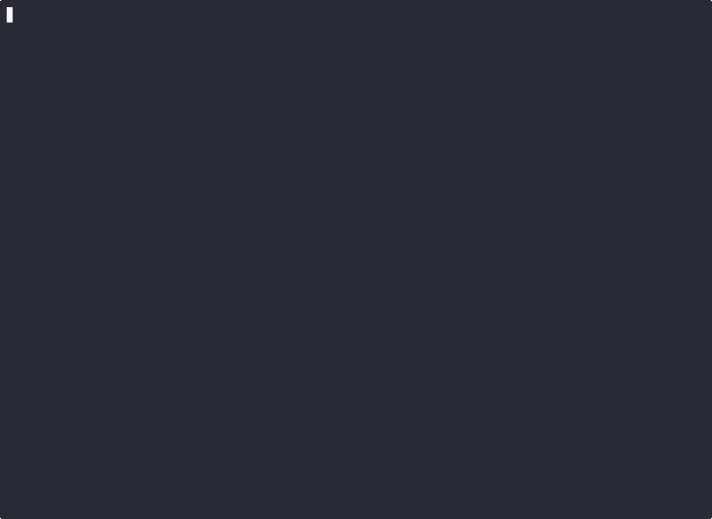
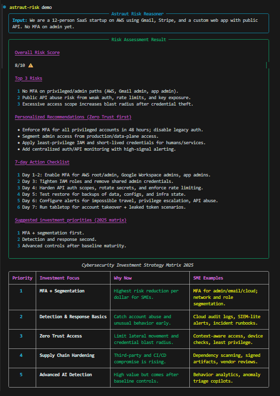

# Astraut Risk Reasoner

AI-powered cybersecurity risk analysis for SMEs from the terminal.


Astraut Risk Reasoner helps small teams translate practical security research into clear, actionable decisions.

## Why This Tool Exists

SMEs rarely have dedicated security teams.

Most risk frameworks are designed for large enterprises.

Astraut Risk Reasoner turns practical cybersecurity research into a simple CLI that helps small teams think clearly about cyber risk before incidents happen.

## Quick Install

```bash
pip install "git+https://github.com/astraut-solutions/astraut-risk-reasoner.git"
```

## Quick Demo

```bash
astraut-risk assess "12-person SaaS company on AWS"
```

If you want output without API keys or network calls:

```bash
astraut-risk demo
```

## Commands

- `astraut-risk assess "..."`: Run AI-assisted risk assessment via Groq.
- `astraut-risk assess "..." --export csv`: Export assessment to CSV.
- `astraut-risk assess "..." --export csv,json`: Export assessment to CSV and JSON.
- `astraut-risk checklist`: Show practical SME baseline checklist.
- `astraut-risk matrix`: Show cybersecurity investment matrix.
- `astraut-risk explain <topic>`: Explain a cybersecurity concept (e.g., `mfa`).
- `astraut-risk demo`: Show static built-in output with no API key.
- `astraut-risk doctor`: Run environment and connectivity checks.

## Configure API Key

```bash
cp .env.example .env
```

Set:

```env
GROQ_API_KEY=your_real_key_here
```

## Example Output

### assess

```text
$ astraut-risk assess "12-person SaaS company on AWS"
╭────────────────────────────────── Astraut Risk Reasoner ──────────────────────────────────╮
│ Input: 12-person SaaS company on AWS                                                       │
╰─────────────────────────────────────────────────────────────────────────────────────────────╯
╭────────────────────────────────── Risk Assessment Result ──────────────────────────────────╮
│ ## Overall Risk Score                                                                       │
│ 7/10 ⚠️                                                                                     │
│                                                                                             │
│ ## Top 3 Risks                                                                              │
│ 1. Privileged account takeover risk from weak MFA coverage.                                 │
│ 2. API abuse risk from incomplete authentication and throttling.                            │
│ 3. Over-broad access policies increase blast radius.                                        │
│                                                                                             │
│ ## Personalized Recommendations (Zero Trust first)                                          │
│ - Enforce MFA on admin and cloud accounts first.                                            │
│ - Segment admin access and tighten IAM privileges.                                          │
│ - Add centralized logging and alerting for auth anomalies.                                  │
╰─────────────────────────────────────────────────────────────────────────────────────────────╯
```

### checklist

```text
$ astraut-risk checklist
╭────────────────────────────────── SME Security Checklist ──────────────────────────────────╮
│ • [ ] Enable MFA for all admin, cloud, email, finance, and code-repo accounts.             │
│ • [ ] Define least-privilege access and remove stale users every month.                     │
│ • [ ] Segment production, staging, and internal admin networks.                             │
│ • [ ] Back up critical systems daily and test restore quarterly.                            │
╰──────────────────────────────── Practical baseline controls ────────────────────────────────╯
```

### matrix

```text
$ astraut-risk matrix
                             Cybersecurity Investment Strategy Matrix 2025
╭──────────┬─────────────────────────────┬─────────────────────────────┬──────────────────────────────╮
│ Priority │ Investment Focus            │ Why Now                     │ SME Examples                 │
├──────────┼─────────────────────────────┼─────────────────────────────┼──────────────────────────────┤
│ 1        │ MFA + Segmentation          │ Highest risk reduction      │ MFA for admin/email/cloud;   │
│          │                             │ per dollar for SMEs.        │ network and role segmentation│
╰──────────┴─────────────────────────────┴─────────────────────────────┴──────────────────────────────╯
```

## How It Works

```text
User input
  ↓
Typer CLI
  ↓
Risk reasoning prompt
  ↓
Groq LLM
  ↓
Structured output
  ↓
Rich terminal rendering
```

## Project Structure

```text
src/astraut_risk/
  cli.py
  reasoning.py
  output.py
  checklist.py
  matrix.py
  config.py
```

## Terminal Screenshots

Live terminal capture:



Static screenshot:



## Security Notice

This tool provides general guidance and does not replace professional cybersecurity assessment.

## Development

```bash
make install
make lint
make format
make test
```

## Web Demo

```bash
pip install -r requirements.txt
streamlit run web/app.py
```

This launches a local browser interface for running assessments, viewing the SME checklist, and reviewing the investment matrix.

## Roadmap

- [ ] Offline mode with Ollama
- [ ] Web interface
- [ ] CSV export
- [ ] Integration with Easy Risk Register
- [ ] SME threat scenario library

## Contributing

See [CONTRIBUTING.md](CONTRIBUTING.md).

## License

MIT. See [LICENSE](LICENSE).
