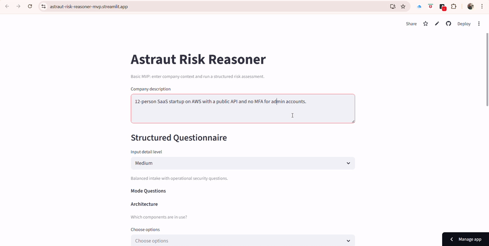

# Astraut Risk Reasoner MVP

Turn a short company description into a basic cybersecurity risk assessment.

This open-source MVP is intentionally simple:
- deterministic risk score
- top risks
- practical recommendations
- structured questionnaire (general / medium / full detailed)

## Demo

<table align="center" width="100%" cellspacing="0" cellpadding="14" border="1">
  <tr>
    <td align="center">
      <strong>Live product walkthrough</strong><br />
      <a href="./demo/astraut-risk-reasoner-mvp.mp4">
        <picture>
          <source media="(prefers-color-scheme: dark)" srcset="./demo/astraut-risk-reasoner-mvp-dark.gif" />
          <source media="(prefers-color-scheme: light)" srcset="./demo/astraut-risk-reasoner-mvp.gif" />
          
        </picture>
      </a>
    </td>
  </tr>
</table>

## Quick Start

Use a local virtual environment so the setup is reproducible and does not depend on
system Python packages.

```bash
python3 -m venv .venv
source .venv/bin/activate
pip install -e ".[dev]"
astraut-risk demo
```

## CLI Commands (No API Key)

- `astraut-risk demo`: static output without API key.
- `astraut-risk inspect "..."`: deterministic signal breakdown.
- `astraut-risk explain mfa`: built-in glossary topics.
- `astraut-risk questionnaire-options`: show assessment input-depth options.
- `astraut-risk doctor`: local environment checks.

## CLI Commands (Requires `GROQ_API_KEY`)

- `astraut-risk assess "..."`: main assessment flow.
- `astraut-risk scenario list`: list built-in scenarios.
- `astraut-risk scenario run <id>`: run a built-in scenario.
- `astraut-risk explain <topic>` for non-built-in topics.

## API Setup (for `assess` / `scenario run` / custom `explain`)

```bash
cp .env.example .env
```

Set:

```env
GROQ_API_KEY=your_real_key_here
```

## Web App

Web UI is deterministic-only (no API key required) and includes:
- Structured Questionnaire
- Input detail level: General (minimal), Medium, Full Detailed
- Mode-based question blocks + company context fields

```bash
source .venv/bin/activate
pip install -r requirements.txt
streamlit run web/app.py
```

## Development

```bash
make install
make lint
make format
make test
```

## Notes

- This tool is for early risk prioritization.
- It is not a formal audit or compliance certification tool.
